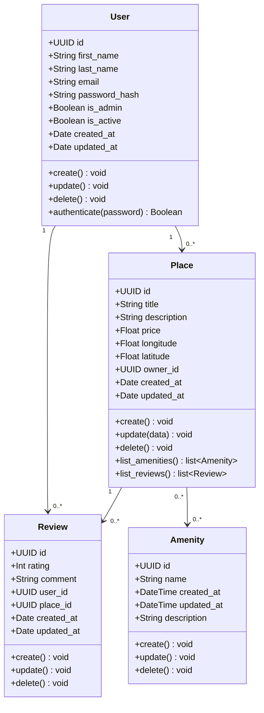

# HBnB Evolution — Part 1: Technical Documentation

**High-Level Architecture, Business Logic Design, and API Interaction Flows**

Repository: `holbertonschool-hbnb` — Directory: `part1`

---

## Table of Contents

1. [Introduction](#1-introduction)

2. [High-Level Architecture](#2-high-level-architecture)

   - [2.1 The Three Layers](#21-the-three-layers)

   - [2.2 The Facade Pattern](#22-the-facade-pattern)

   - [2.3 Package Diagram](#23-package-diagram)

3. [Business Logic Layer](#3-business-logic-layer)

   - [3.1 Class Diagram](#31-class-diagram)

   - [3.2 Entity Descriptions](#32-entity-descriptions)

   - [3.3 Relationships](#33-relationships)

4. [API Interaction Flow](#4-api-interaction-flow)

   - [4.1 User Registration](#41-user-registration)

   - [4.2 Place Creation](#42-place-creation)

   - [4.3 Review Submission](#43-review-submission)

   - [4.4 Fetching a List of Places](#44-fetching-a-list-of-places)

---

## 1. Introduction

This document outlines the technical architecture for Phase 1 of HBnB Evolution—a lightweight property rental platform. The system establishes the foundational mechanics for user registration, real estate listing creation ("places"), stay feedback (reviews), and feature options (amenities).

The purpose of this blueprint is to cement the core design before any development begins. This ensures that Phase 2 (API Delivery) and Phase 3 (Database Integration) build upon a structured framework rather than an improvised codebase.

The platform is specified from three distinct perspectives:

-A Package Diagram: Illustrating the vertical layer configurations.

-A Class Diagram: Mapping the core objects and behaviors of the Business Logic layer.

-Sequence Diagrams: Tracing the runtime data flows during primary API operations.

Together, the first two components define the static structure of the system, while the third illustrates its dynamic runtime behavior, providing a complete view of the application and its data flows.

---  

## 3. Business Logic Layer

This layer is built around four entities: User, Place, Review, and Amenity. Each one gets a UUID id, plus created_at and updated_at timestamps — that part's the same across the board, for auditing.

### 3.1 Class Diagram

*Figure 2 — Detailed class diagram for the Business Logic layer: User, Place, Review, and Amenity, with their attributes, methods, and relationships.*

---

### 3.2 Entity Descriptions

#### **User**

A registered account on the platform — first name, last name, email, password_hash, an is_admin flag to tell regular users apart from admins, and an is_active flag. Users can be created, updated, deleted, and can authenticate using their password. One user can own several places and write several reviews.

#### **Place**

A property listing — title, description, price, longitude, latitude, and an explicit owner_id tracking its owner. Every place has exactly one owner. Places support create, update, and delete operations, and provide specific operations to list their attached amenities (`list_amenities()`) and reviews (`list_reviews()`).

#### **Review**

Feedback left on a place — an integer rating and a text comment. Every review explicitly references its author via `user_id` and the associated property via `place_id`. Reviews can be created, updated, and deleted.

#### **Amenity**

A feature a place can offer — name and description, tracked with `DateTime` timestamps. Amenities exist independently and support their own create, update, and delete operations.

---

### 3.3 Relationships

| Relationship | Multiplicity | Type | Description |
| --- | --- | --- | --- |
| **User → Place** | 1 to 0..* | Association | A User owns zero or more Places; each Place links back via `owner_id`. |
| **User → Review** | 1 to 0..* | Association | A User writes zero or more Reviews; each Review links back via `user_id`. |
| **Place → Review** | 1 to 0..* | Association | A Place receives zero or more Reviews; each Review links back via `place_id`. |
| **Place → Amenity** | 0..* to 0..* | Directed Association | A Place can reference many Amenities, and an Amenity can be associated with many Places (Unidirectional reference from Place to Amenity). |

> **Note:** All four entities carry the same base `id: UUID` field. Timestamps (`created_at` / `updated_at`) use `Date` for User, Place, and Review, and `DateTime` for Amenity — so every record can be uniquely identified and traced over time.

 
