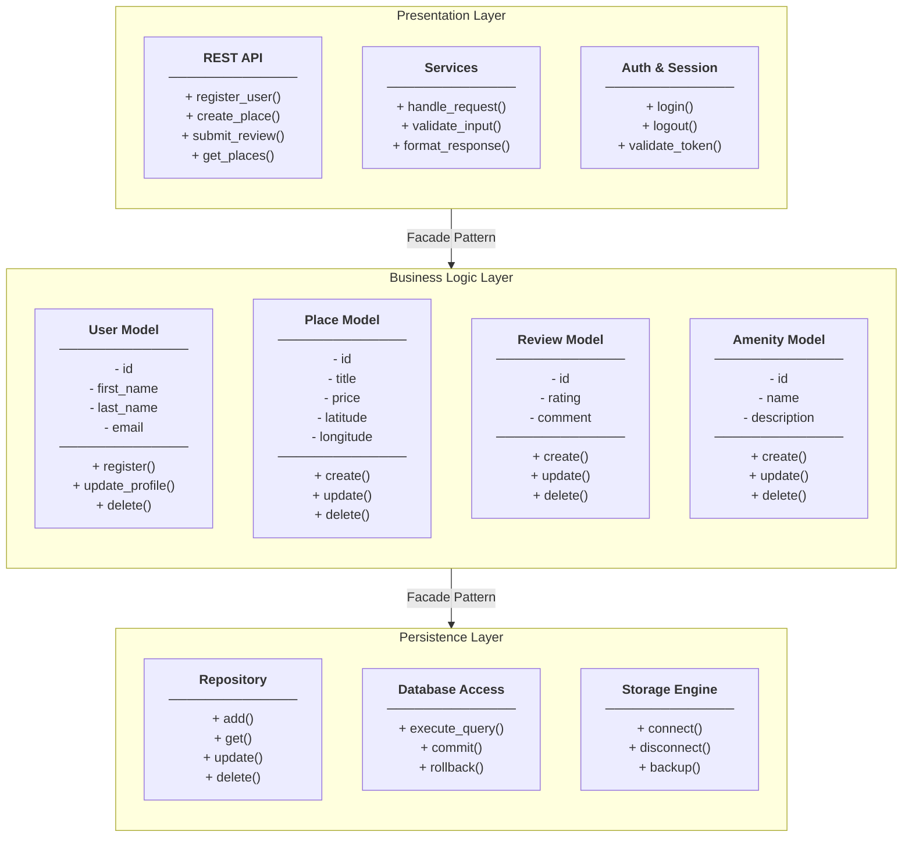
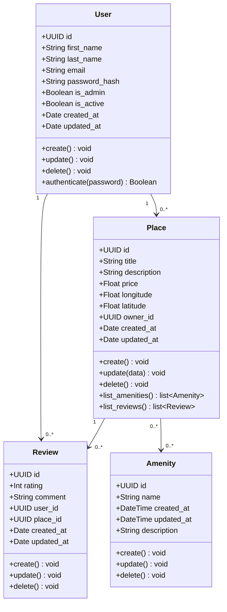
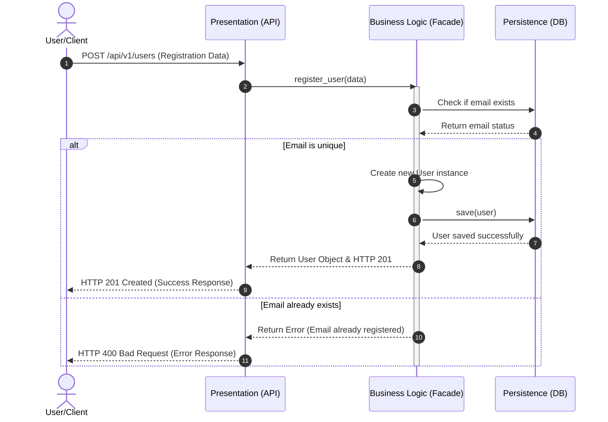
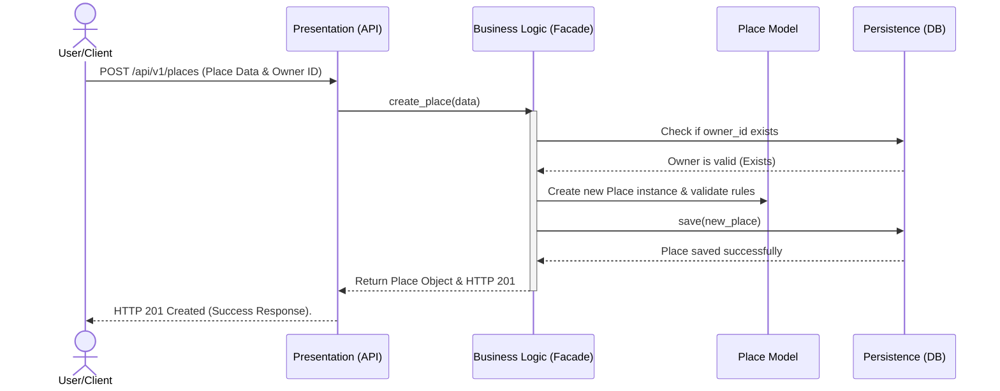
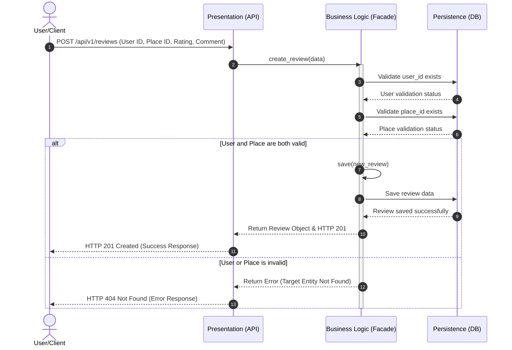
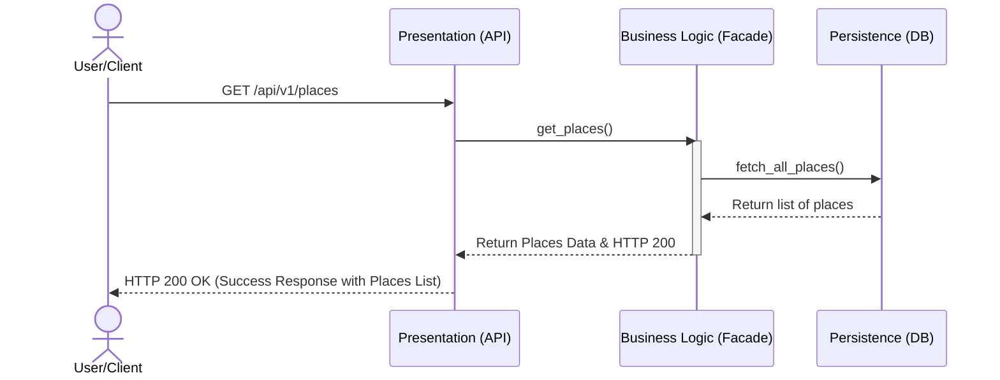

## Holberton school -HBnB
 HBnB Evolution 

# Part 1: Technical Documentation 
Application Architecture

**High-Level Architecture, Business Logic Design, and API Interaction Flows**

Repository: `holbertonschool-hbnb` — Directory: `part1`

---

## Table of Contents

1. [Introduction](#1-introduction)

2. [High-Level Architecture](#2-high-level-architecture)

   - [2.1 The Three Layers](#21-the-three-layers)

   - [2.2 The Facade Pattern](#22-the-facade-pattern)

   - [2.3 Package Diagram](#23-package-diagram)

3. [Business Logic Layer](#3-business-logic-layer)

   - [3.1 Class Diagram](#31-class-diagram)

   - [3.2 Entity Descriptions](#32-entity-descriptions)

   - [3.3 Relationships](#33-relationships)

4. [API Interaction Flow](#4-api-interaction-flow)

   - [4.1 User Registration](#41-user-registration)

   - [4.2 Place Creation](#42-place-creation)

   - [4.3 Review Submission](#43-review-submission)

   - [4.4 Fetching a List of Places](#44-fetching-a-list-of-places)

---

# Part 1 - Technical Documentation

---

## 1. Introduction

This document outlines the technical architecture for Phase 1 of HBnB Evolution—a lightweight property rental platform.a simplified platform inspired by AirBnB. 
The objective of this phase is to layout a solid foundation detailing the high-level architecture, business entities, core logic, and step-by-step system interactions across all runtime operations.
The system establishes the foundational mechanics for user registration, real estate listing creation ("places"), stay feedback (reviews), and feature options (amenities).

The purpose of this blueprint is to cement the core design before any development begins. This ensures that Phase 2 (API Delivery) and Phase 3 (Database Integration) build upon a structured framework rather than an improvised codebase.

The platform is specified from three distinct perspectives:

-A Package Diagram: Illustrating the vertical layer configurations.

-A Class Diagram: Mapping the core objects and behaviors of the Business Logic layer.

-Sequence Diagrams: Tracing the runtime data flows during primary API operations.

Together, the first two components define the static structure of the system, while the third illustrates its dynamic runtime behavior, providing a complete view of the application and its data flows.

---

## 2. High-Level Architecture

### 2.1 The Three Layers

The HBnB Evolution application follows a The Three Layers (Zoom out):

1. **Presentation Layer**
2. **Business Logic Layer**
3. **Persistence Layer**

Each layer communicates with the one directly below it through the **Facade Pattern**.
You Can not skip anylayer.
---

### Layer Descriptions

#### 1. Presentation Layer
- **Responsibility:** Handles all user-facing interactions.
- **Components:**
  - REST API (routes and endpoints)
  - Services (request handling)
  - Auth / Session (token validation)
- **Rule:** This layer does NOT contain business rules such as (Data validation and Entity Relationship Rules),and does NOT access the database directly.

#### 2. Business Logic Layer
- **Responsibility:** Contains the core models and rules of the application.
- **Components:**
  - **User** - handles registration and profile updates
  - **Place** - handles property listings and management
  - **Review** - handles ratings and comments
  - **Amenity** - handles features associated with places
- **Rule:** This layer does NOT know about HTTP or the database. It only applies business rules.

#### 3. Persistence Layer
- **Responsibility:** Stores and retrieves all data (The complex subsystem)
- **Components:**
  - Repository (CRUD operations)
  - Database Access (SQL / ORM queries)
  - Storage Engine (file or database backend)
- **Rule:** This layer does NOT apply rules. It only saves and loads data.

---

### 2.2 The Facade Pattern

The **Facade Pattern** acts as a simplified interface between layers (The complex subsystem)
- The Presentation Layer calls the Facade to reach the Business Logic Layer.
- The Business Logic Layer calls the Facade to reach the Persistence Layer.
- No layer skips another. This keeps the code organized and easy to maintain.
-The Facade layer hides this complexity from the Service or API layer, so the rest of the application doesn't need to know how or where data is being saved.

*for more details (if you wish) you can see the relationship between the Facade Pattern flow and the the three layers of package diagram in the package_diagram.md file.

---

### 2.3 Package Diagram

See below The `package_diagram` 

---
This diagram shows the three-layer architecture of the HBnB application
and how the layers communicate via the Facade Pattern.

## Explanatory Notes

### 1. Layers Overview

* **Presentation Layer:** This is the entry point of the application. It handles all 
incoming HTTP requests from the user through the REST API, manages services for request 
handling, and validates user authentication via session tokens.

* **Business Logic Layer:** This is the brain of the application. It contains the core 
models and rules that drive the system:
    * **User** - manages user registration and profile updates
    * **Place** - manages property listings and their details
    * **Review** - manages ratings and comments left by users
    * **Amenity** - manages features that can be associated with places

* **Persistence Layer:** This layer is responsible for storing and retrieving all 
application data. It contains the repository for CRUD operations, database access 
for SQL and ORM queries, and the storage engine that connects to the file or 
database backend.

### 2. Communication Between Layers

The layers communicate through the **Facade Pattern**, which acts as a simplified 
interface between each layer:

* The **Presentation Layer** never accesses the database directly. Instead it calls 
the Facade to reach the Business Logic Layer.
* The **Business Logic Layer** never writes to the database directly. Instead it calls 
the Facade to reach the Persistence Layer.
* This ensures each layer has one clear responsibility and changes in one layer do 
not break the others.

---  

## 3. Business Logic Layer

This layer is built around four entities: User, Place, Review, and Amenity. Each one gets a UUID id, plus created_at and updated_at timestamps — that part's the same across the board, for auditing.

### 3.1 Class Diagram

*Figure 2 — Detailed class diagram for the Business Logic layer: User, Place, Review, and Amenity, with their attributes, methods, and relationships.*

---

### 3.2 Entity Descriptions

#### **User**

A registered account on the platform — first name, last name, email, password_hash, an is_admin flag to tell regular users apart from admins, and an is_active flag. Users can be created, updated, deleted, and can authenticate using their password. One user can own several places and write several reviews.

#### **Place**

A property listing — title, description, price, longitude, latitude, and an explicit owner_id tracking its owner. Every place has exactly one owner. Places support create, update, and delete operations, and provide specific operations to list their attached amenities (`list_amenities()`) and reviews (`list_reviews()`).

#### **Review**

Feedback left on a place — an integer rating and a text comment. Every review explicitly references its author via `user_id` and the associated property via `place_id`. Reviews can be created, updated, and deleted.

#### **Amenity**

A feature a place can offer — name and description, tracked with `DateTime` timestamps. Amenities exist independently and support their own create, update, and delete operations.

---

### 3.3 Relationships

| Relationship | Multiplicity | Type | Description |
| --- | --- | --- | --- |
| **User → Place** | 1 to 0..* | Association | A User owns zero or more Places; each Place links back via `owner_id`. |
| **User → Review** | 1 to 0..* | Association | A User writes zero or more Reviews; each Review links back via `user_id`. |
| **Place → Review** | 1 to 0..* | Association | A Place receives zero or more Reviews; each Review links back via `place_id`. |
| **Place → Amenity** | 0..* to 0..* | Directed Association | A Place can reference many Amenities, and an Amenity can be associated with many Places (Unidirectional reference from Place to Amenity). |

> **Note:** All four entities carry the same base `id: UUID` field. Timestamps (`created_at` / `updated_at`) use `Date` for User, Place, and Review, and `DateTime` for Amenity — so every record can be uniquely identified and traced over time.

 # 4. API Interaction Flow

In this section, we describe how the system handles the primary API operations during runtime. The sequence diagrams illustrate the step-by-step communication between the **Presentation Layer**, the **Business Logic Layer (Facade)**, and the **Persistence Layer**, ensuring that no layer is bypassed.

---

### 4.1 User Registration
This flow handles the process of creating a new user account. The system checks if the email is already registered before saving the user data.

    
    Explanatory Notes:
* **Purpose:** register new users safely and prevent duplicate accounts with the same email.
* **Design Decision:** The Business Logic Layer requests the database to verify the email first. If the email exists, the system stops the process and returns an HTTP 400 Bad Request error immediately.

### 4.2 Place Creation
This diagram tracks the steps required when an authorized user creates a new property listing (place). The place must be linked to a valid user who acts as the owner.

   
    Explanatory Notes:
* **Purpose:** create a property listing and assign it to the correct owner.
* **Design Decision:** The system contacts the database to ensure the owner_id exists before initializing the Place Model. Then, it validates specific attributes like price and coordinates before saving the record.

### 4.3 Review Submission
This flow shows how a user submits a review and rating for a specific place. The system ensures that both the user and the place are valid before creating the review.

Explanatory Notes:
* **Purpose:** To handle user feedback and connect the review safely to both the user and the place.
* **Design Decision:** Dual validation is required. If either the user_id or place_id is not found in the database, the system rejects the request and returns an HTTP 404 Not Found error.

### 4.4 Fetching a List of Places
This diagram outlines the process of retrieving all property listings from the system.

Explanatory Notes:
* **Purpose:** To load all existing properties so they can be viewed on the front-end client interface.
* **Design Decision:** This is a simple read operation. The Facade directly passes the request to the Persistence Layer and updates nothing, returning an HTTP 200 OK response with the complete list of places.

  ##Authors:
  Haad
  Areej Al-Ghamdi   <areejaa12@gmail.com>
  Hadeel Al-Qahtani <hadeel.alqhtani206@gmail.com>
