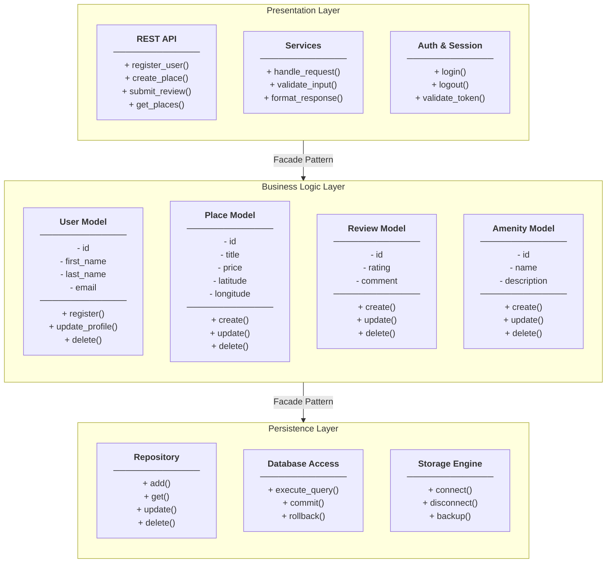

# holbertonschool-hbnb
HBnB Evolution project

# Part 1 - Technical Documentation

## HBnB Evolution - Application Architecture

---

## Overview

## This document provides the technical documentation for the HBnB Evolution application.
A simplified HBnB-like platform. It covers the overall architecture, the detailed
design of the business logic, and the interactions within the system.

---

## Task 0 - High-Level Architecture

### Architecture Overview

The HBnB Evolution application follows a **three-layer architecture** (Zoom out):

1. **Presentation Layer**
2. **Business Logic Layer**
3. **Persistence Layer**

Each layer communicates with the one directly below it through the **Facade Pattern**.
You Can not skip anylayer.
---

### Layer Descriptions

#### 1. Presentation Layer
- **Responsibility:** Handles all user-facing interactions.
- **Components:**
  - REST API (routes and endpoints)
  - Services (request handling)
  - Auth / Session (token validation)
- **Rule:** This layer does NOT contain business rules such as (Data validation and Entity Relationship Rules),and does NOT access the database directly.

#### 2. Business Logic Layer
- **Responsibility:** Contains the core models and rules of the application.
- **Components:**
  - **User** - handles registration and profile updates
  - **Place** - handles property listings and management
  - **Review** - handles ratings and comments
  - **Amenity** - handles features associated with places
- **Rule:** This layer does NOT know about HTTP or the database. It only applies business rules.

#### 3. Persistence Layer
- **Responsibility:** Stores and retrieves all data (The complex subsystem)
- **Components:**
  - Repository (CRUD operations)
  - Database Access (SQL / ORM queries)
  - Storage Engine (file or database backend)
- **Rule:** This layer does NOT apply rules. It only saves and loads data.

---

### The Facade Pattern

The **Facade Pattern** acts as a simplified interface between layers (The complex subsystem)
- The Presentation Layer calls the Facade to reach the Business Logic Layer.
- The Business Logic Layer calls the Facade to reach the Persistence Layer.
- No layer skips another. This keeps the code organized and easy to maintain.
-The Facade layer hides this complexity from the Service or API layer, so the rest of the application doesn't need to know how or where data is being saved.

---

### 2.3 Package Diagram

See the file `package_diagram` in this directory for the visual diagram. Need Auditing
This diagram shows the three-layer architecture of the HBnB application
and how the layers communicate via the Facade Pattern.

## Explanatory Notes

### 1. Layers Overview

* **Presentation Layer:** This is the entry point of the application. It handles all 
incoming HTTP requests from the user through the REST API, manages services for request 
handling, and validates user authentication via session tokens.

* **Business Logic Layer:** This is the brain of the application. It contains the core 
models and rules that drive the system:
    * **User** - manages user registration and profile updates
    * **Place** - manages property listings and their details
    * **Review** - manages ratings and comments left by users
    * **Amenity** - manages features that can be associated with places

* **Persistence Layer:** This layer is responsible for storing and retrieving all 
application data. It contains the repository for CRUD operations, database access 
for SQL and ORM queries, and the storage engine that connects to the file or 
database backend.

### 2. Communication Between Layers

The layers communicate through the **Facade Pattern**, which acts as a simplified 
interface between each layer:

* The **Presentation Layer** never accesses the database directly. Instead it calls 
the Facade to reach the Business Logic Layer.
* The **Business Logic Layer** never writes to the database directly. Instead it calls 
the Facade to reach the Persistence Layer.
* This ensures each layer has one clear responsibility and changes in one layer do 
not break the others.

---

## Authors
-Ahaad AL-Qahtani  <Email>
-Areej Al-Ghamdi   <Email>
-Hadeel Al-Qahatni <Email>

-Hadeel Al-Qahatni <Email>
