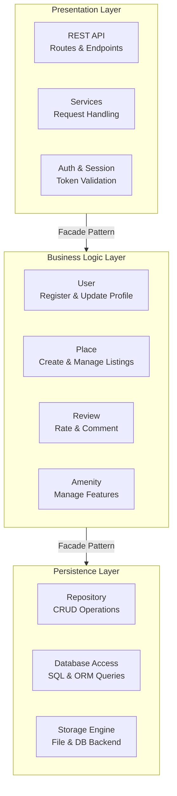

# HBnB Application - Package Diagram

This diagram shows the three-layer architecture of the HBnB application
and how the layers communicate via the Facade Pattern.

## Explanatory Notes

### 1. Layers Overview

* **Presentation Layer:** This is the entry point of the application. It handles all 
incoming HTTP requests from the user through the REST API, manages services for request 
handling, and validates user authentication via session tokens.

* **Business Logic Layer:** This is the brain of the application. It contains the core 
models and rules that drive the system:
    * **User** - manages user registration and profile updates
    * **Place** - manages property listings and their details
    * **Review** - manages ratings and comments left by users
    * **Amenity** - manages features that can be associated with places

* **Persistence Layer:** This layer is responsible for storing and retrieving all 
application data. It contains the repository for CRUD operations, database access 
for SQL and ORM queries, and the storage engine that connects to the file or 
database backend.

### 2. Communication Between Layers

The layers communicate through the **Facade Pattern**, which acts as a simplified 
interface between each layer:

* The **Presentation Layer** never accesses the database directly. Instead it calls 
the Facade to reach the Business Logic Layer.
* The **Business Logic Layer** never writes to the database directly. Instead it calls 
the Facade to reach the Persistence Layer.
* This ensures each layer has one clear responsibility and changes in one layer do 
not break the others.
