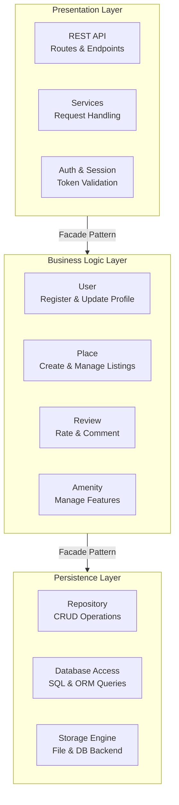

# HBnB Application - Package Diagram

This diagram shows the three-layer architecture of the HBnB application
and how the layers communicate via the Facade Pattern.

```mermaid
graph TD
    subgraph Presentation[" Presentation Layer"]
        API["REST API\nRoutes & Endpoints"]
        Services["Services\nRequest Handling"]
        Auth["Auth & Session\nToken Validation"]
    end

    subgraph Business[" Business Logic Layer"]
        User["User\nRegister & Update Profile"]
        Place["Place\nCreate & Manage Listings"]
        Review["Review\nRate & Comment"]
        Amenity["Amenity\nManage Features"]
    end

    subgraph Persistence[" Persistence Layer"]
        Repo["Repository\nCRUD Operations"]
        DB["Database Access\nSQL & ORM Queries"]
        Storage["Storage Engine\nFile & DB Backend"]
    end

    Presentation -->|Facade Pattern| Business
    Business -->|Facade Pattern| Persistence
```
