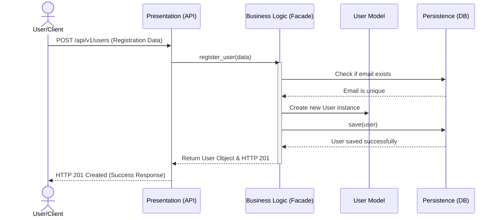
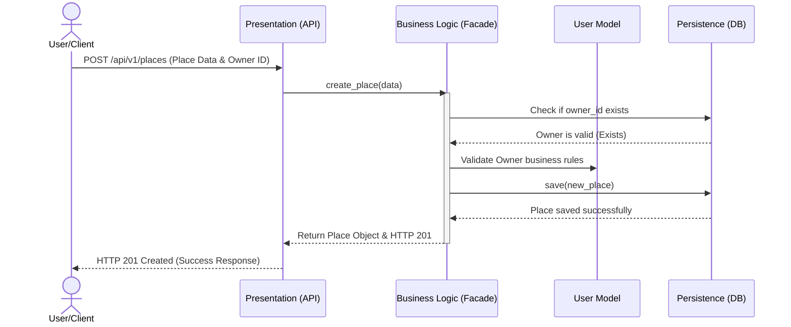
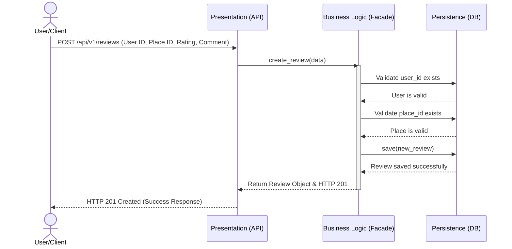
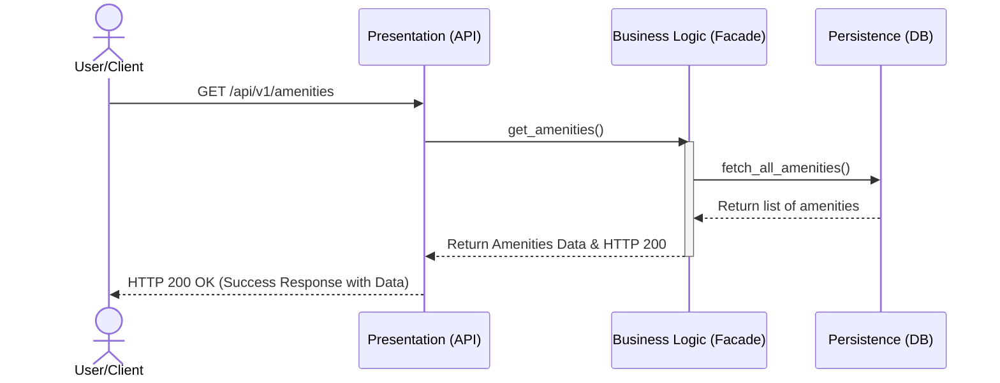

## 1. User Registration Sequence Diagram

```mermaid
sequenceDiagram
    actor Client as User/Client
    participant API as Presentation (API)
    participant Facade as Business Logic (Facade)
    participant Model as User Model
    participant DB as Persistence (DB)

    Client->>API: POST /api/v1/users (Registration Data)
    API->>Facade: register_user(data)
    activate Facade
    Facade->>DB: Check if email exists
    DB-->>Facade: Email is unique
    Facade->>Model: Create new User instance
    Facade->>DB: save(user)
    DB-->>Facade: User saved successfully
    Facade-->>API: Return User Object & HTTP 201
    deactivate Facade
    API-->>Client: HTTP 201 Created (Success Response)
```

## 2. Place Creation Sequence Diagram

```mermaid
sequenceDiagram
    actor Client as User/Client
    participant API as Presentation (API)
    participant Facade as Business Logic (Facade)
    participant UserModel as User Model
    participant DB as Persistence (DB)

    Client->>API: POST /api/v1/places (Place Data & Owner ID)
    API->>Facade: create_place(data)
    activate Facade
    Facade->>DB: Check if owner_id exists
    DB-->>Facade: Owner is valid (Exists)
    Facade->>UserModel: Validate Owner business rules
    Facade->>DB: save(new_place)
    DB-->>Facade: Place saved successfully
    Facade-->>API: Return Place Object & HTTP 201
    deactivate Facade
    API-->>Client: HTTP 201 Created (Success Response)
```

## 3. Review Submission Sequence Diagram

```mermaid
sequenceDiagram
    actor Client as User/Client
    participant API as Presentation (API)
    participant Facade as Business Logic (Facade)
    participant DB as Persistence (DB)

    Client->>API: POST /api/v1/reviews (User ID, Place ID, Rating, Comment)
    API->>Facade: create_review(data)
    activate Facade
    Facade->>DB: Validate user_id exists
    DB-->>Facade: User is valid
    Facade->>DB: Validate place_id exists
    DB-->>Facade: Place is valid
    Facade->>DB: save(new_review)
    DB-->>Facade: Review saved successfully
    Facade-->>API: Return Review Object & HTTP 201
    deactivate Facade
    API-->>Client: HTTP 201 Created (Success Response)
```
## 4. Fetch Amenities Sequence Diagram

```mermaid
sequenceDiagram
    actor Client as User/Client
    participant API as Presentation (API)
    participant Facade as Business Logic (Facade)
    participant DB as Persistence (DB)

    Client->>API: GET /api/v1/amenities
    API->>Facade: get_amenities()
    activate Facade
    Facade->>DB: fetch_all_amenities()
    DB-->>Facade: Return list of amenities
    Facade-->>API: Return Amenities Data & HTTP 200
    deactivate Facade
    API-->>Client: HTTP 200 OK (Success Response with Data)
```