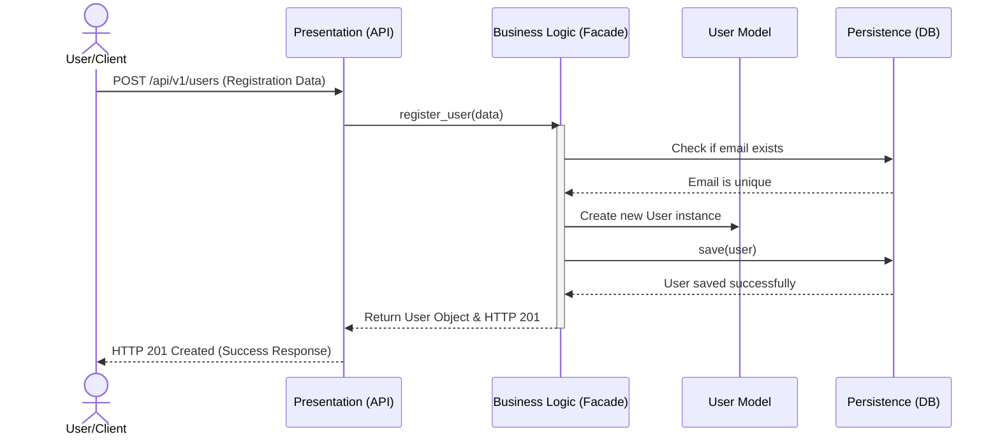

## 1. User Registration Sequence Diagram

```mermaid
sequenceDiagram
    actor Client as User/Client
    participant API as Presentation (API)
    participant Facade as Business Logic (Facade)
    participant Model as User Model
    participant DB as Persistence (DB)

    Client->>API: POST /api/v1/users (Registration Data)
    API->>Facade: register_user(data)
    activate Facade
    Facade->>DB: Check if email exists
    DB-->>Facade: Email is unique
    Facade->>Model: Create new User instance
    Facade->>DB: save(user)
    DB-->>Facade: User saved successfully
    Facade-->>API: Return User Object & HTTP 201
    deactivate Facade
    API-->>Client: HTTP 201 Created (Success Response)
```