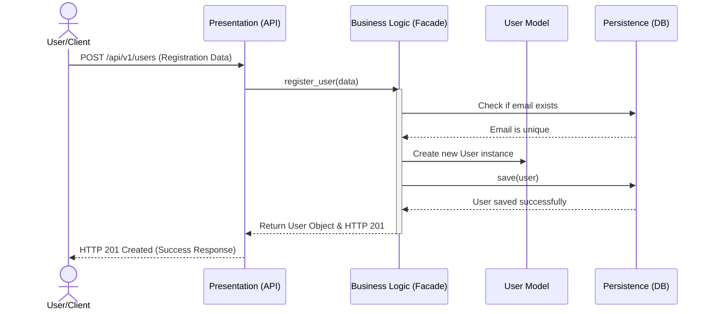
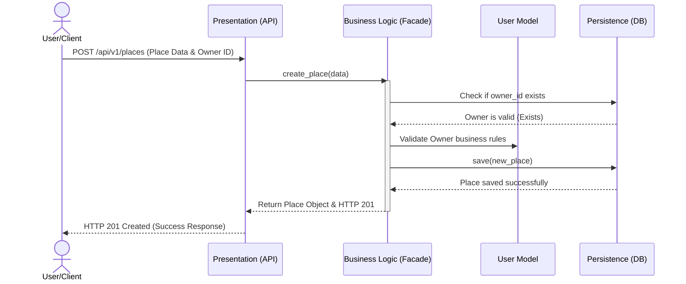
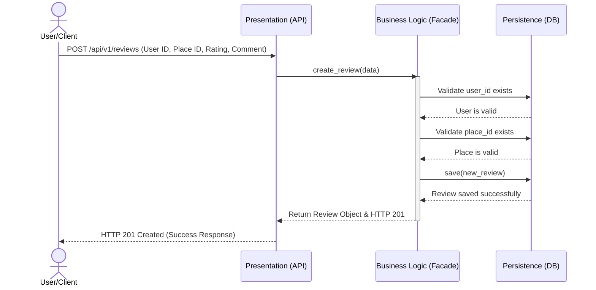
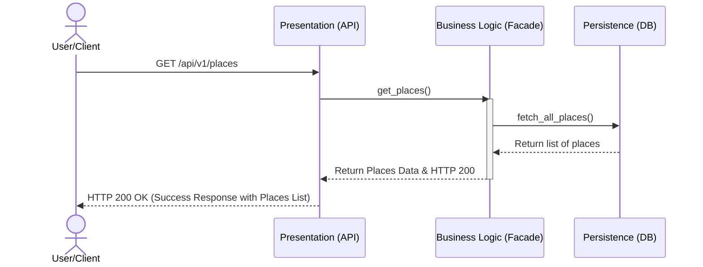

## 1. User Registration Sequence Diagram

## 2. Place Creation Sequence Diagram

## 3. Review Submission Sequence Diagram

## 4. Fetching a List of Places Sequence Diagram

---

## Explanatory Notes

### 1. User Registration
* **Purpose**: Illustrates the step-by-step process of creating a new user account.
* **Flow**: The request hits the **Presentation Layer (API)**, which triggers the **Business Logic (Facade)** to check if the user's email already exists in the **Persistence Layer (DB)**. Once validated as unique, a new User Model is created and saved successfully.

### 2. Place Creation
* **Purpose**: Visualizes how a user lists a new place in the application.
* **Flow**: The **API** sends the data to the **Facade**. The system verifies the `owner_id` against the **DB** to ensure the owner exists, validates the business rules, and then persists the new place object.

### 3. Review Submission
* **Purpose**: Demonstrates the process of a user submitting a review and rating for a specific place.
* **Flow**: The **Presentation Layer** forwards the payload to the **Business Logic**. The **Facade** cross-checks both the `user_id` and `place_id` in the **Database** to ensure they are valid before saving the review record.

### 4. Fetching a List of Places
* **Purpose**: Shows how the system handles a request to retrieve all place listings.
* **Flow**: The client sends a GET request to the **API**. The **Facade** communicates directly with the **Persistence Layer (DB)** to fetch all stored places and routes the clean data back to the client with an HTTP 200 OK status.
