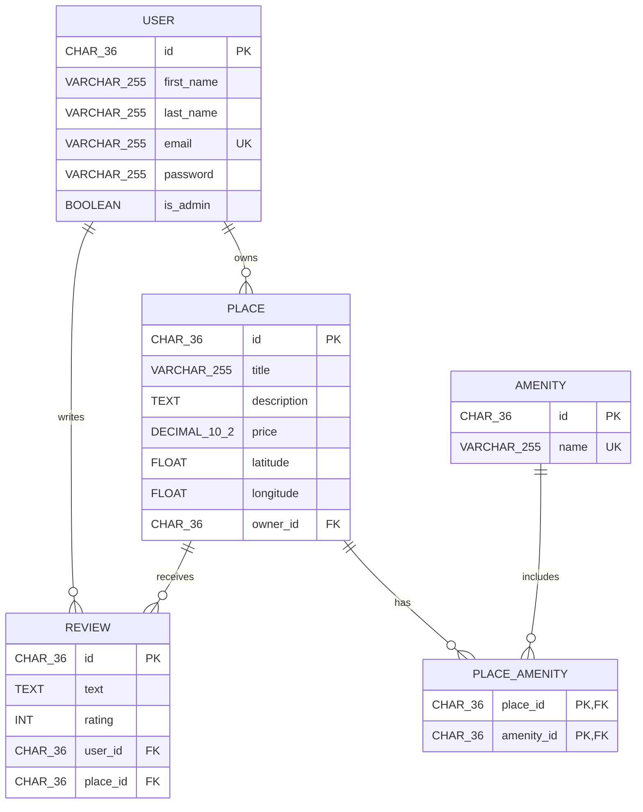

# HBnB Database ER Diagram

```mermaid
erDiagram
    USER {
        CHAR_36 id PK
        VARCHAR_255 first_name
        VARCHAR_255 last_name
        VARCHAR_255 email UK
        VARCHAR_255 password
        BOOLEAN is_admin
    }

    PLACE {
        CHAR_36 id PK
        VARCHAR_255 title
        TEXT description
        DECIMAL_10_2 price
        FLOAT latitude
        FLOAT longitude
        CHAR_36 owner_id FK
    }

    REVIEW {
        CHAR_36 id PK
        TEXT text
        INT rating
        CHAR_36 user_id FK
        CHAR_36 place_id FK
    }

    AMENITY {
        CHAR_36 id PK
        VARCHAR_255 name UK
    }

    PLACE_AMENITY {
        CHAR_36 place_id PK, FK
        CHAR_36 amenity_id PK, FK
    }

    USER ||--o{ PLACE : owns
    USER ||--o{ REVIEW : writes
    PLACE ||--o{ REVIEW : receives
    PLACE ||--o{ PLACE_AMENITY : has
    AMENITY ||--o{ PLACE_AMENITY : includes
```