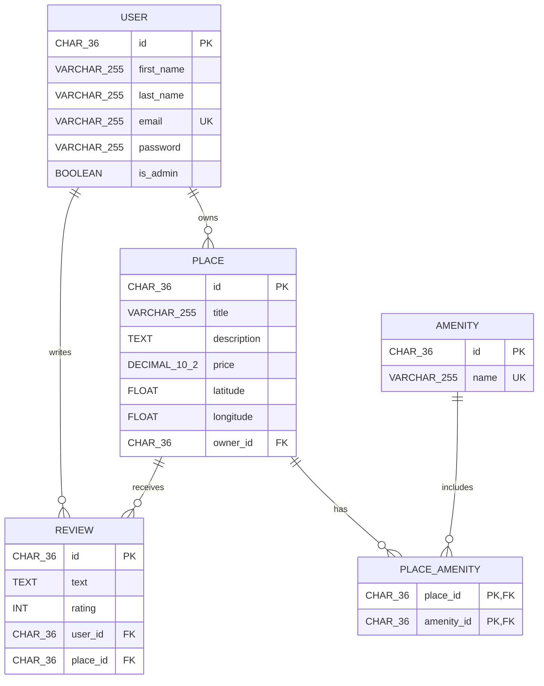
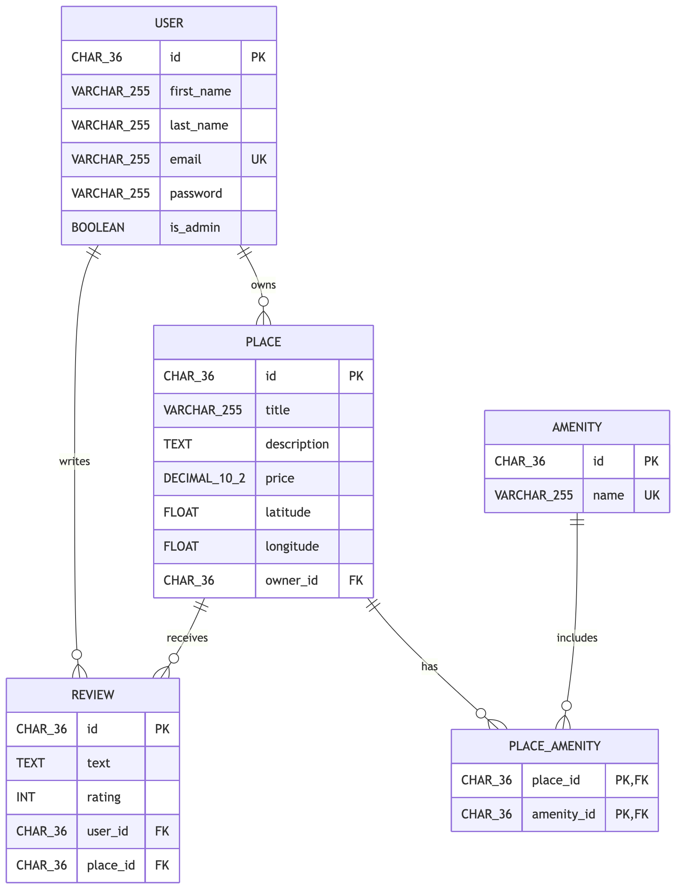

# HBnB Database ER Diagram

## Relationship Summary

- A user can own multiple places, while each place belongs to one user.
- A user can write multiple reviews, while each review belongs to one user.
- A place can receive multiple reviews, while each review belongs to one place.
- Places and amenities have a many-to-many relationship through the `PLACE_AMENITY` association table.

## Database Constraints

- User emails are unique.
- Amenity names are unique.
- A user can submit only one review per place.
- Review ratings must be between 1 and 5.
- The combination of `place_id` and `amenity_id` forms the composite primary key of `PLACE_AMENITY`.

## Exported Diagram

